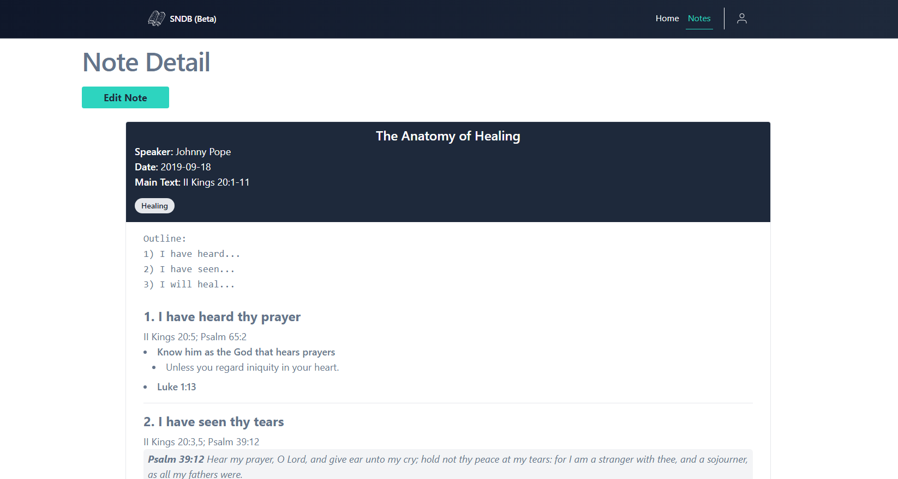
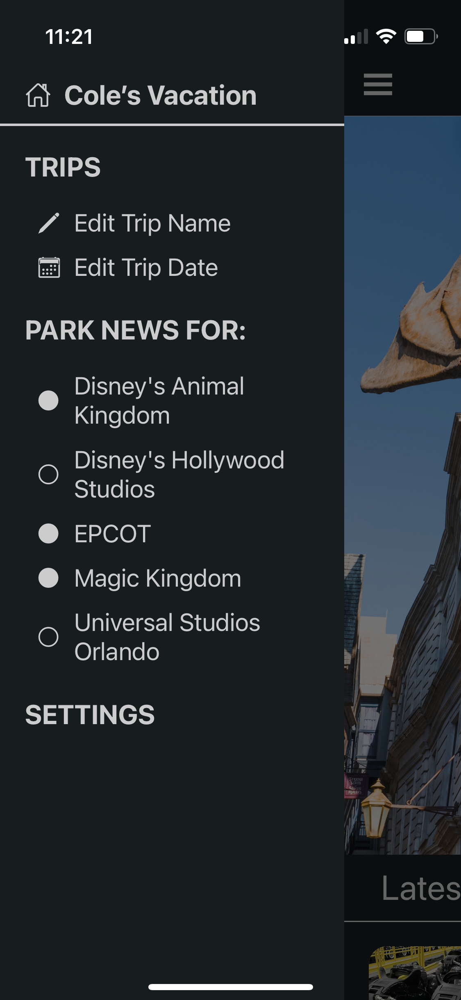
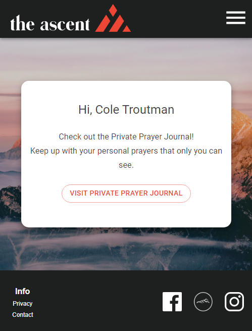
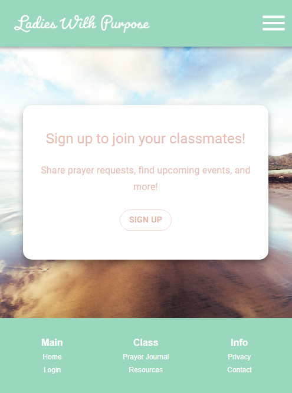
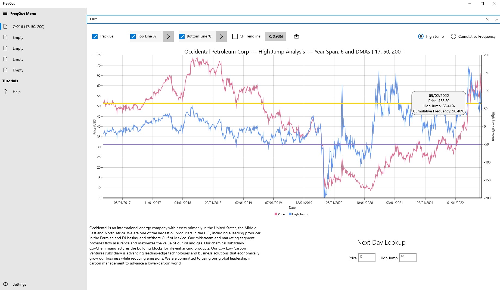
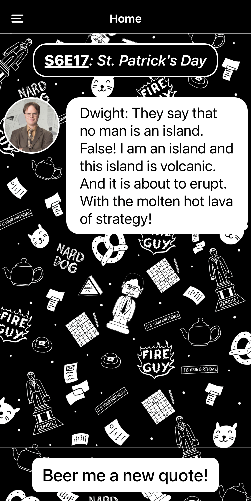

## About Me
Hi there 👋, I'm Cole. I'm a software engineer from Houston, Texas. I studied Computer Science at Texas Tech University and then went on to get my Master's degree in
Cyber Security from the University of Texas at San Antonio. After schooling, I worked for 2 years at a software development company called Reynolds and Reynolds and am currently working at Life.Church as a Software Engineer on the YouVersion Team.  
My main project interests revolve around church ministry and helping my wife understand what I do.

---

## Technologies I Use

---

## **Personal Projects I Am Currently Working On**
### **1. Sermon Note Database**

| SermonNoteDB Beta  |
| ------------- |
|   |

A simple place to store personal sermon/Bible study notes for future reference.  
[Visit the Site](https://sermonnotedb.com) (currently in Beta, but functional)

### **2. Vacation Countdown mobile app**

This is a mobile application for the hype leading up to a vaction (specifically Disney).  
Article Links from various Disney blogs are displayed to the user depending on which parks 
they will be visiting, and a Countdown timer is displayed.
- There are many more features to be added to this application, but this is just a start.

| Home Page  | Menu |
| ------------- | ------------- |
|   |   |

---

## **Examples of Personal Projects I've Worked On in the Past**
### **1. Bible Study Class and Private Prayer Journals - Created in 2020**

| [The Ascent Basecamp](https://theascentbasecamp.com)  | [Ladies with Purpose](https://cbfladieswithpurpose.com) |
| ------------- | ------------- |
|   |    |
 

### **2. FreqOut (High Jump Stock Analysis Tool) - 2019**

| Cumulative ***Freq***uency ***Out***lier Analysis  |
| ------------- |
|   |

[PDF Documentaion (Features and Purpose)](./FreqOutDocs.pdf)

### **3. The Office TV Show Quotes Mobile App - 2019 (and then redone in 2022)**

**Every** Office quote in the show.

I will probably never be able to put this on the app store due to copyrights, but it was a fun personal project.

| The Office Quotes Home Page |
| ------------- |
|   |

---

## Interests
When I am not coding, I enjoy watching Liverpool FC games, playing video games, or reading (probably The Lord of the Rings again).
